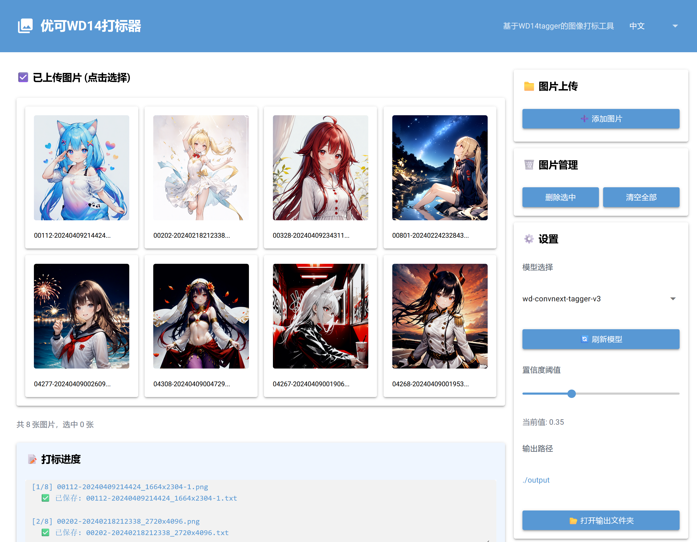
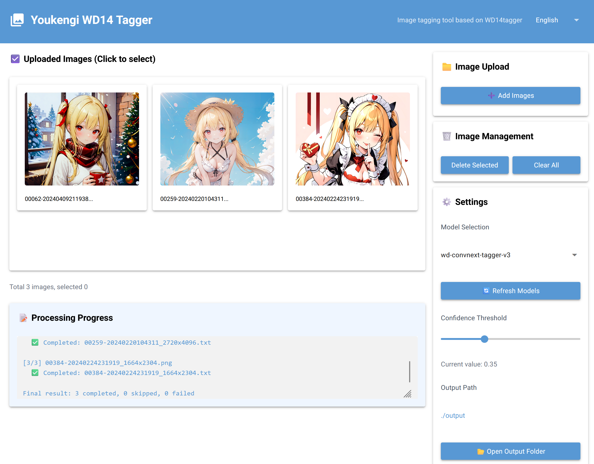

# WD14 Tagger 打标器

基于 WD14tagger 模型的图片自动打标工具，支持批量处理图片并生成英文标签。

## 功能特点

- 🎯 **自动打标**：使用 WD14tagger 模型自动识别图片内容并生成标签
- 📁 **批量处理**：支持同时上传多张图片进行批量打标
- 🌐 **Web界面**：使用 NiceGUI 构建的响应式 Web 界面，操作简单直观
- 💾 **标签保存**：自动将标签保存为对应的 `.txt` 文件
- ⚡ **异步处理**：后台线程处理，不阻塞 UI 界面
- 🔄 **智能跳过**：自动跳过已存在标签文件的图片

## 环境要求

- Python 3.8+
- 虚拟环境（推荐）

## 安装步骤

### 1. 创建并激活虚拟环境

```bash
# 创建虚拟环境
python -m venv venv

# 激活虚拟环境（Windows）
venv\Scripts\activate

# 激活虚拟环境（Linux/Mac）
source venv/bin/activate
```

### 2. 安装依赖

```bash
# 安装依赖
pip install -r requirements.txt
```

### 3. 准备模型文件

将 WD14tagger 模型文件放置在 `models` 文件夹中，目录结构如下：

```
wd14_tagger_app/
├── models/
│   └── wd-v1-4-vit-tagger-v2/  # 模型文件夹
│       ├── model.onnx          # ONNX 模型文件
│       └── selected_tags.csv   # 标签文件
├── wd14_tagger_app.py          # 主应用文件
├── requirements.txt            # 依赖文件
└── README.md                   # 说明文档
```

## 使用方法

### 1. 启动应用

```bash
# 启动应用
python wd14_tagger_app.py
```

应用将在 `http://localhost:7860` 启动，并自动打开浏览器。

### 2. 上传图片

- 点击 "添加图片" 按钮选择要打标的图片
- 支持批量选择多张图片
- 上传后图片会显示在左侧预览区

### 3. 配置打标参数

- **模型选择**：选择要使用的 WD14tagger 模型
- **置信度阈值**：调整标签生成的置信度阈值（默认 0.35）
- **输出目录**：设置标签文件的保存目录（默认 `./output`）

### 4. 开始打标

- 选择要打标的图片（可多选）
- 点击 "开始打标" 按钮开始处理
- 处理进度会显示在进度信息框中

### 5. 查看结果

- 打标完成后，标签会自动保存为对应的 `.txt` 文件
- 点击 "打开输出文件夹" 按钮查看生成的标签文件

## 项目结构

```
wd14_tagger_app/
├── models/              # 模型文件夹
├── output/              # 标签输出文件夹
├── wd14_tagger_app.py   # 主应用文件
├── requirements.txt     # 依赖文件
└── README.md            # 说明文档
```

## 界面预览

### 中文界面


### 英文界面


## 技术实现

- **Web框架**：NiceGUI
- **模型推理**：ONNX Runtime
- **图像处理**：Pillow + OpenCV
- **异步处理**：线程池
- **国际化**：支持中英文双语切换

## 注意事项

1. 首次使用时，模型加载可能需要一些时间
2. 打标速度取决于图片数量和计算机性能
3. 建议使用置信度阈值 0.35-0.5，过高会导致标签过少，过低会导致标签过多
4. 目前仅支持英文标签输出

## 故障排除

### 常见问题

1. **模型加载失败**：检查模型文件是否完整，路径是否正确
2. **图片预处理失败**：检查图片文件是否损坏，格式是否支持
3. **标签文件过大**：系统会自动检测并重新打标超过 1KB 的标签文件

### 日志查看

应用运行时的日志会显示在终端中，可用于排查问题。

## 许可证

本项目基于 Apache License 2.0 开源。
